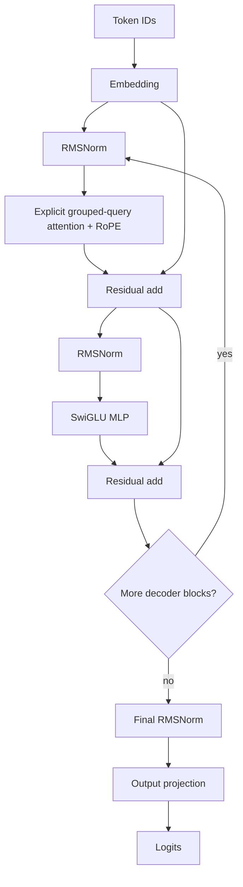

# TensorForge — GPU Inference Runtime & Kernel Optimization

TensorForge is an open-source, correctness-first laboratory for building a small Llama-style GPU
inference runtime from transparent PyTorch operators toward fused Triton kernels, paged KV caching,
continuous batching, and shape-aware CUDA Graph execution. It is deliberately not a chatbot, a
Hugging Face wrapper, or a thin layer over vLLM/TensorRT-LLM.

**Current status: Phase 1 complete.** The repository contains a readable inference baseline and its
correctness contracts. It contains **no performance claims yet**: measurement and profiling begin in
Phase 2, and raw results will be checked in only after running the reproducible harness on named
hardware.

## What is implemented

- Decoder-only Llama-style model with token embedding, grouped-query causal attention, RoPE,
  FP32-accumulating RMSNorm, SwiGLU MLP, residual paths, final norm, and output projection.
- Deliberately unoptimized full-prefix greedy generation, which is the oracle for future KV-cached
  decode.
- Batch- and sequence-shape coverage plus FP32, FP16, and BF16 execution when the device supports it.
- Unit contracts for causal isolation, operator formulas, generation equivalence, EOS termination,
  invalid inputs, masks, and CUDA precision modes.
- A phased architecture and experiment plan in
  [`docs/implementation-plan.md`](docs/implementation-plan.md).
- Reproducibility evidence and an explicit claim boundary in
  [`docs/phase-1-validation.md`](docs/phase-1-validation.md).

## Baseline architecture



The baseline attention intentionally spells out projection, RoPE, grouped KV expansion, score
matmul, causal masking, FP32 softmax, and value aggregation. This is not expected to beat PyTorch
SDPA; it makes correctness and Phase 2 profiler attribution inspectable. Likewise, baseline decode
recomputes the prefix on every token. Those are measured control paths, not proposed optimizations.

## Quick start

Python 3.11+ and PyTorch 2.5+ are required.

```bash
python -m venv .venv
source .venv/bin/activate
python -m pip install -e ".[dev]"
pytest
python -m scripts.smoke_generate --device cuda --dtype fp16
```

On Windows, activate with `.venv\\Scripts\\Activate.ps1`. Official Triton work is planned for a
Linux CUDA environment in Phase 3; `pip install -e ".[dev,kernels]"` installs it where supported.

## Correctness policy

The PyTorch model is the semantic reference. Low-precision operators accumulate sensitive
reductions in FP32. Later kernels must compare multiple shapes and supported dtypes with documented
absolute/relative tolerances. Generation tests compare every greedy token against independent
full-prefix steps. An optimization that exceeds tolerance or changes output behavior is rejected or
explicitly scoped; throughput never overrides correctness.

## Roadmap and benchmark methodology

The [implementation plan](docs/implementation-plan.md) specifies eight gated phases, experiment
records, the required workload matrix, OOM accounting, and one-factor-at-a-time ablations. Phase 2
will record TTFT, TPOT, tokens/s, per-request P50/P95/P99, allocated/peak memory, utilization when
available, and complete hardware/software metadata in JSON, CSV, and Markdown.

Later reports will explicitly cover optimizations that lose on small or awkward shapes. Empty
[`results/`](results/README.md) and [`benchmarks/`](benchmarks/README.md) directories are intentional:
TensorForge does not publish invented example measurements.

## Design tradeoffs

- **Clarity before speed:** explicit attention is expensive but supplies a stable oracle.
- **Small default model:** dimensions fit commodity GPUs and make experiments accessible; this is
  infrastructure validation, not a language-quality claim.
- **No heavyweight inference engine:** optimized behavior remains attributable to this repository.
- **No premature cache interface:** Phase 4 will introduce cache contracts after Phase 2 establishes
  allocation and decode bottlenecks, avoiding an API shaped by guesses.
- **Single-GPU first:** multi-GPU work remains optional until the one-GPU path is correct and measured.

## Repository map

```text
tensorforge/model/       mathematical reference model and operators
tensorforge/runtime/     execution and generation policy
tensorforge/kernels/     Triton kernels (Phase 3)
tensorforge/cache/       KV-cache lifecycle (Phase 4)
tensorforge/scheduler/   request state machine (Phase 5)
tensorforge/profiling/   profiler capture and analysis (Phase 2)
tensorforge/metrics/     latency and runtime instruments (Phase 2)
tensorforge/benchmark/   workloads, runners, and report generation (Phase 2)
tests/                   CPU correctness and capability-gated CUDA tests
scripts/                 reproducible entry points
benchmarks/              immutable workload definitions
results/                 raw and rendered measured results
```

## License

Apache-2.0.
