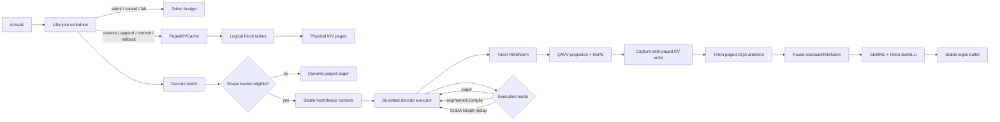

# TensorForge

**A correctness-first, benchmark-driven LLM inference runtime built with PyTorch, Triton, paged KV
caching, continuous batching, and CUDA Graphs.**

[](https://www.python.org/)
[](https://pytorch.org/)
[](LICENSE)

TensorForge is a small research-grade GPU inference runtime for studying the systems problems behind
autoregressive LLM serving. It starts from a transparent Llama-style PyTorch model and builds a
single optimized decode path around custom Triton kernels, transactional paged KV memory,
request-level scheduling, stable execution buckets, segmented `torch.compile`, and explicit CUDA
Graph replay.

It is not a chatbot, a Hugging Face wrapper, or a thin adapter over vLLM/TensorRT-LLM. The project
keeps the mathematical reference, allocator, scheduler, kernels, execution policy, measurement
tools, and raw experimental evidence visible so that every optimization can be explained and
tested independently.

> **Status:** Phase 8R is complete. The runtime now imports a pinned real Llama checkpoint,
> performs parallel causal prefill directly into the transactional paged cache, accepts wall-clock
> arrivals, and compares the same greedy token workload with Transformers SDPA and vLLM. Published
> results remain tied to a clean Git commit and include regressions.

## Why this project exists

An inference optimization is only useful when four things remain true:

1. token and logit semantics still match an independent full-prefix model;
2. cache ownership remains correct through append, rollback, cancellation, failure, and exhaustion;
3. the improvement survives an explicit timing boundary on real hardware;
4. the result states which baseline it beat and which claims it does not support.

TensorForge is organized around those constraints. The result is an inspectable runtime rather than
a collection of disconnected kernel demos.

## Highlights

- A decoder-only Llama implementation with GQA, RoPE, RMSNorm, SwiGLU, causal masking, residual
  paths, and FP32 accumulation for sensitive reductions.
- Custom autotuned Triton kernels for RMSNorm, fused residual/RMSNorm, and SwiGLU, including
  caller-owned output buffers for address-stable replay.
- A real paged GQA decode-attention kernel using logical-to-physical block tables and online
  softmax, plus a two-stage split-KV path for long contexts.
- One transactional `PagedKVCache` with atomic reservation, append, full or partial commit,
  rollback, deterministic reclamation, exhaustion behavior, and non-contiguous physical pages.
- A continuous-batching scheduler with `queued -> prefill -> decode -> completed/failed` lifecycle,
  request/global token budgets, cancellation, failure isolation, and leak-free cache recovery.
- A strict Hugging Face Llama safetensors importer plus unequal-length parallel SDPA prefill that
  writes the canonical paged cache without constructing a second cache abstraction.
- Shape-bucketed decode with persistent host/device controls and intermediate buffers, explicit
  graph hit/miss/fallback accounting, and safe dynamic-eager fallback.
- Real-checkpoint workloads with external monotonic arrival timestamps and a comparison protocol
  that pins checkpoint revision and file hashes, token inputs, greedy semantics, timing boundary,
  hardware, and software versions.
- Reproducible benchmark manifests with P50/P95/P99 latency, throughput, cold JIT/compile/capture
  cost, hardware/software identity, randomized variant order, numerical gates, and raw samples.
- Stress coverage for request churn, KV exhaustion, padded lanes, cross-page writes, non-contiguous
  mappings, partial rollback, and final allocator/budget cleanup.

## Measured results

The latest cumulative experiment used an NVIDIA RTX 3080 Ti under WSL2, PyTorch 2.5.1+cu121,
CUDA 12.1, Triton 3.1.0, FP16 weights/cache, and a four-layer 256-wide test model. Six batch/context
shapes produced 42 variant rows and 3,360 measured decode samples. Setup costs were excluded from
steady-state latency, and every run passed an independent full-prefix logit gate.

| Experiment | Result on the published workload | Important boundary |
|---|---|---|
| Triton scalar kernels | 1.40–5.00x over the explicit PyTorch formulas | Kernel-only Phase 3 matrix |
| Paged GQA attention | 1.273–25.033x over expanded-GQA PyTorch | Not an SDPA/FlashAttention/vLLM comparison |
| Split-KV attention | 3.51–3.55x over one-pass Triton at context 2,048 | Clean one-factor long-context ablation |
| Continuous batching | +12.0% burst and +27.4% churn mean throughput vs static | Median TPOT regressed 11.4% and 9.4% |
| Segmented `torch.compile` | Improved 4/6 final-path shapes by 13.1–27.0% | Regressed two shapes by 1.5–1.9% |
| Explicit CUDA Graph | 52.9–87.8% lower mean latency vs fully fused eager | 137–152 ms capture cost; 480/0 hit/miss |

CUDA Graph was the only uniformly positive final-path specialization. Individual Triton kernels
were faster in isolation, but the cumulative experiment showed that Triton SwiGLU regressed four of
six end-to-end shapes—by as much as 60.4% versus its causal parent. Address-stable eager and
standalone RMSNorm also regressed on some shapes. These rows remain in the report because enabling
an optimization is not evidence that it helped.

Full P50/P95/P99 values, throughput, setup cost, per-run ordering, graph counters, hardware state,
and raw samples are available in the
[Phase 7A report](results/reference/phase7a-rtx3080ti-wsl/execution.md) and
[validation record](docs/phase-7a-validation.md).

Phase 8R uses a pinned TinyLlama 1.1B checkpoint and the same deterministic BF16 token workload
across TensorForge, Transformers SDPA, and vLLM. Model load and tokenization are excluded. Values
below are per-run output-throughput P50; this is an external reference comparison, not a
one-factor ablation.

| Workload | TensorForge | Transformers SDPA | vLLM |
|---|---:|---:|---:|
| B1, prompt 32, output 8 | 26.42 tok/s | 24.30 tok/s | 129.90 tok/s |
| B4 burst, prompt 32, output 8 | 114.77 tok/s | 113.65 tok/s | 516.30 tok/s |
| B1, prompt 128, output 16 | 18.16 tok/s | 35.35 tok/s | 149.60 tok/s |

vLLM is 4.50–8.24x TensorForge on comparable rows. The P128 free-running token sequence diverges at
an exact BF16 top-logit tie; the long teacher-forced logit/cache gate still passes. Multi-token
paged-cache writes improve 6.28x, 30.67x, and 119.12x at 32, 128, and 512 tokens respectively,
while the one-token direct-copy path is preserved. See the
[Phase 8R comparison](results/reference/phase8r-rtx3080ti-wsl/comparison.md) and
[validation record](docs/phase-8r-validation.md) for raw variance, latency tails, hashes, software
differences, and the claim boundary.

## System architecture



The scheduler owns request state and selection. `PagedKVCache` exclusively owns sequences,
reservations, pages, and transaction outcomes. Kernels own tensor math. The bucket executor owns
stable staging and replay buffers. This separation prevents CUDA Graph or batching policy from
creating a second cache implementation.

Real prompt ingestion follows a separate parallel path before decode: Q/K/V and causal SDPA operate
over the whole prompt, valid K/V rows are scattered through each request's logical-to-physical
block table, and reservations commit only after every layer succeeds. Unequal prompt lengths share
a padded batch while masking both causal and invalid positions.

## Core implementation

### 1. Mathematical reference

The reference model spells out token embedding, grouped-query attention, RoPE, FP32 softmax,
RMSNorm, SwiGLU, residual connections, and output projection. Full-prefix greedy generation
recomputes all previous tokens and acts as the independent semantic oracle for incremental decode.

The explicit baseline is intentionally readable and is not presented as the fastest available
PyTorch attention implementation.

### 2. Triton scalar and fusion kernels

RMSNorm and residual/RMSNorm reduce in FP32, then cast back to the input dtype. SwiGLU implements
`silu(gate) * up`. Autotuning searches warp and block configurations across decode, batched decode,
prefill, awkward-width, FP16, BF16, and FP32 shapes.

Every kernel supports numerical correctness gates and records first-call tuning/JIT separately from
steady state. Caller-owned outputs let the same kernels execute inside persistent decode buckets and
CUDA Graph captures without changing addresses.

### 3. Paged GQA decode attention

Each logical sequence stores a block table rather than requiring contiguous physical K/V storage.
The decode kernel maps logical token positions through physical page IDs, maps query heads to KV
heads without materializing repeated K/V tensors, applies a stable online softmax, and writes into a
caller-provided output tensor.

Long contexts can use split-KV: the first kernel produces partition statistics and partial outputs;
the second merges them with the log-sum-exp correction. The implementation supports unequal batch
lengths, partial pages, and deliberately non-contiguous page tables.

### 4. Transactional paged KV cache

An append is a transaction:

```text
reserve logical tokens and any required physical pages
    -> expose append locations
    -> write every model layer
    -> commit all, commit an accepted prefix, or roll back
```

Allocation failure is atomic. Rollback reclaims only transaction-owned pages. Release cancels active
reservations and returns the complete sequence allocation. Partial commit is already part of the
cache contract, although speculative draft/target execution is intentionally not implemented.

### 5. Continuous batching

Requests move through explicit `queued`, `prefill`, `decode`, `completed`, and `failed` states.
Admission checks both per-request and global token budgets before mutating runtime state. No
batching, static batching, and continuous batching share the same executor and cache, making the
policy comparison attributable.

Seeded stress workloads interleave arrivals, execution, and cancellation while checking maximum
batch size, token budget, cache ownership, terminal accounting, and leak-free shutdown after every
operation.

### 6. Stable buckets, compile, and CUDA Graphs

A bucket is keyed by batch and context capacity. It owns persistent pinned-host controls, device
controls, block tables, positions, append destinations, masks, attention workspaces, intermediate
activations, and logits. Inactive padded lanes are masked from KV writes.

`torch.compile(dynamic=False)` specializes the PyTorch model segments; custom Triton calls remain
explicit graph boundaries. Explicit CUDA Graph mode captures the fixed-address GPU path after
side-stream warmup. Scheduler decisions, cache allocation, transaction completion, and two small
host-to-device control copies stay outside capture. Oversized shapes fall back to dynamic eager and
record the reason.

### 7. Real checkpoints and parallel prefill

The checkpoint adapter reads a fail-closed Llama configuration subset and maps every safetensors
key into TensorForge's transparent model hierarchy. Missing and unexpected tensors are rejected;
the benchmark manifest pins the Hugging Face commit and reports SHA256 identities for config and
weights.

Parallel prefill reserves the complete prompt transaction, executes causal GQA with PyTorch SDPA,
and scatters K/V into the same physical pages consumed by Triton decode. Multi-token cache writes
use vectorized physical-page indexing, while the latency-sensitive one-token case retains direct
copies. The scheduler preserves caller-supplied monotonic arrival timestamps, so queueing and tail
latency include requests that arrived while a GPU step was running.

Transformers and vLLM are external references, not causal ablation parents. Reports retain their
different attention/cache/graph paths, isolated dependency stacks, unsupported workload rows, and
output-token hashes instead of claiming architectural parity.

## Correctness invariants

Performance changes are accepted only after these contracts pass:

- incremental logits and greedy tokens match independent full-prefix execution;
- FP16/BF16 kernels satisfy dtype-specific combined absolute/relative tolerances;
- logical token order is preserved across partial and non-contiguous physical pages;
- allocation exhaustion does not leave partially owned blocks;
- commit, partial commit, rollback, cancellation, and failure restore exact allocator accounting;
- inactive graph lanes cannot write KV state;
- persistent buffer addresses do not move between appends or graph replays;
- every stress or benchmark run terminates with zero leaked sequences, pages, reservations, and
  token budget.

The current full WSL CUDA/Triton/real-checkpoint suite contains **180 passing tests**. The Windows
control suite contains **78 passing tests**; Triton-only tests are capability-skipped there because upstream
Triton execution requires Linux.

## Installation

### CPU/reference development

```bash
git clone https://github.com/Kakarottoooo/TensorForge.git
cd TensorForge
python -m venv .venv
source .venv/bin/activate
python -m pip install --upgrade pip
python -m pip install -e ".[dev]"
pytest -q
```

On Windows, activate the environment with `.venv\Scripts\Activate.ps1`.

### CUDA and Triton

The published GPU environment uses Python 3.11 in Linux/WSL2. An NVIDIA GPU and compatible driver
are required.

```bash
bash scripts/setup_phase3_wsl.sh
source ~/.venvs/tensorforge-py311/bin/activate
pytest -q
python -m scripts.smoke_generate --device cuda --dtype fp16
```

The helper pins the project-tested CUDA/PyTorch/Triton dependency set. A generic Linux environment
can instead install `.[dev,kernels]`, but version drift should be recorded with new measurements.

Real-checkpoint tests and the Transformers reference require `.[models]`. Install vLLM in a
separate environment because it owns exact Torch, Triton, and CUDA package versions:

```bash
python -m pip install -e ".[dev,kernels,models]"

python -m venv ~/.venvs/tensorforge-vllm
~/.venvs/tensorforge-vllm/bin/python -m pip install -e ".[vllm-reference]"
```

## Reproducing the experiments

All committed experiments use immutable JSON manifests. Write exploratory output under
`results/local/`; curated `results/reference/` data is commit-associated evidence.

```bash
# PyTorch baseline and profiler
python -m scripts.run_benchmarks \
  --manifest benchmarks/phase2-reference.json \
  --output-dir results/local/phase2-reference \
  --device cuda:0

python -m scripts.profile_model \
  --output-dir results/local/profile \
  --prompt-length 512 --decode-steps 4 --precision fp16

# Triton scalar kernels and roofline model
python -m scripts.benchmark_kernels \
  --manifest benchmarks/phase3-kernels.json \
  --output-dir results/local/phase3-kernels

# Paged GQA attention and split-KV
python -m scripts.benchmark_attention \
  --manifest benchmarks/phase4-attention.json \
  --output-dir results/local/phase4-attention

# Request lifecycle and scheduling policies
python -m scripts.benchmark_scheduler \
  --manifest benchmarks/phase5-scheduler.json \
  --output-dir results/local/phase5-scheduler

# Stable eager / compile / CUDA Graph
python -m scripts.benchmark_execution \
  --manifest benchmarks/phase6-execution.json \
  --output-dir results/local/phase6-execution

# Final cumulative decode-path ablation
python -m scripts.benchmark_execution \
  --manifest benchmarks/phase7a-cumulative.json \
  --output-dir results/local/phase7a-cumulative

# Pinned TinyLlama checkpoint: run each backend in its documented environment
python -m scripts.benchmark_checkpoint \
  --manifest benchmarks/phase8-real-checkpoint.json \
  --checkpoint-dir /path/to/pinned/checkpoint \
  --backend tensorforge \
  --output-dir results/local/phase8-real-tensorforge

python -m scripts.benchmark_checkpoint \
  --manifest benchmarks/phase8-real-checkpoint.json \
  --checkpoint-dir /path/to/pinned/checkpoint \
  --backend transformers_sdpa \
  --output-dir results/local/phase8-real-transformers

~/.venvs/tensorforge-vllm/bin/python -m scripts.benchmark_checkpoint \
  --manifest benchmarks/phase8-real-checkpoint.json \
  --checkpoint-dir /path/to/pinned/checkpoint \
  --backend vllm \
  --output-dir results/local/phase8-real-vllm

python -m scripts.compare_checkpoint \
  --reports results/local/phase8-real-{tensorforge,transformers,vllm}/checkpoint.json \
  --output-dir results/local/phase8-real-comparison

# Former scalar loop versus vectorized paged-cache writes
python -m scripts.benchmark_cache_write \
  --output results/local/phase8-cache-write.json
```

For Nsight Systems, use:

```bash
python -m scripts.nsys_profile --output results/local/nsys/baseline
```

Before comparing reports, confirm that hardware fingerprint, model shape, precision, workload,
timing boundary, and measured code commit are compatible. Phase-level speedups use different
workloads and must not be multiplied.

## Benchmark methodology

- CUDA events measure GPU work; synchronization boundaries are explicit.
- Warmups and cold JIT/autotune/compile/capture costs are reported separately.
- Variant order is seed-randomized for every measured repetition.
- Reports retain P50/P95/P99, mean throughput, raw repetitions, and runtime GPU state.
- Each custom kernel is correctness-gated before timing.
- Every end-to-end execution run checks its first measured logit against full-prefix execution.
- Regressions are emitted as results rather than discarded.
- Logical bandwidth and arithmetic intensity use documented semantic-byte/FLOP models; they are not
  substitutes for Nsight Compute DRAM and occupancy counters.

See [benchmark methodology](docs/benchmark-methodology.md) for the complete measurement contract.

## Repository layout

```text
tensorforge/model/       Llama-style mathematical reference
tensorforge/kernels/     Triton scalar, KV-write, and paged-attention kernels
tensorforge/cache/       Transactional paged KV allocator and block tables
tensorforge/scheduler/   Request lifecycle, budgeting, and batching policies
tensorforge/runtime/     Dynamic and bucketed incremental decode executors
tensorforge/benchmark/   Manifests, runners, hardware metadata, and reporting
tensorforge/profiling/   PyTorch profiler capture and analysis
tensorforge/metrics/     Latency statistics and GPU telemetry
tests/                   CPU, CUDA, Triton, failure, and end-to-end contracts
benchmarks/              Immutable experiment definitions
results/reference/       Raw and rendered commit-associated measurements
docs/                    Architecture, methodology, and validation records
scripts/                 Reproducible CLI entry points
```

## Documentation

| Topic | Design | Measured validation |
|---|---|---|
| Reference model | [Implementation plan](docs/implementation-plan.md) | [Phase 1](docs/phase-1-validation.md) |
| Measurement/profiling | [Benchmark methodology](docs/benchmark-methodology.md) | [Phase 2](docs/phase-2-validation.md) |
| Triton scalar kernels | [Kernel design](docs/kernel-design.md) | [Phase 3](docs/phase-3-validation.md) |
| Paged cache and GQA attention | [Cache and attention](docs/paged-cache-and-attention.md) | [Phase 4](docs/phase-4-validation.md) |
| Continuous batching | [Scheduler design](docs/continuous-batching.md) | [Phase 5](docs/phase-5-validation.md) |
| Compile and CUDA Graphs | [Execution specialization](docs/execution-specialization.md) | [Phase 6](docs/phase-6-validation.md) |
| Unified final path | [Cumulative decode path](docs/cumulative-decode-path.md) | [Phase 7A](docs/phase-7a-validation.md) |

## Scope and limitations

TensorForge demonstrates infrastructure behavior with a deliberately small randomly initialized
model; it makes no language-quality claim. The published PyTorch attention control is an explicit
expanded-GQA implementation, not SDPA or FlashAttention. Results come from a shared Windows display
GPU under WSL2, not an isolated persistence-mode datacenter accelerator.

The repository does not currently implement production prefill, prefix sharing, sliding-window
attention, quantized KV cache, speculative draft/target execution, tensor parallelism, multi-GPU
NCCL scaling, or a fair end-to-end vLLM comparison. Those are deliberately excluded from current
claims rather than represented by shallow placeholders.

## License

Apache License 2.0. See [LICENSE](LICENSE).
