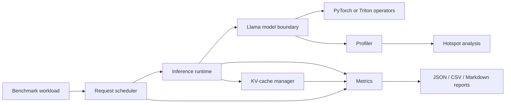

# TensorForge implementation plan

## Invariants

Every optimized path must preserve a separate, readable PyTorch oracle. Each result is tied to
hardware metadata and a workload definition. No optimization is accepted without correctness
tests and an ablation against the immediately preceding configuration. Missing hardware or an
unsupported feature is reported as such; it is never replaced by synthetic numbers.

## Repository architecture

The model package owns mathematical semantics. The runtime owns execution policy. The cache owns
GPU memory lifecycle. The scheduler owns request state transitions, not tensors. Benchmark,
profiling, and metrics consume public boundaries so instrumentation does not contaminate kernels.

## Phased delivery

| Phase | Concrete deliverable | Acceptance gate |
|---|---|---|
| 1 — baseline | Explicit grouped-query Llama model, RoPE, RMSNorm, SwiGLU, greedy decode, FP32/FP16/BF16 selection | CPU unit suite; CUDA smoke for supported dtypes; causal and decode equivalence tests |
| 2 — measurement control plane | Versioned workloads, request timelines, hardware fingerprinting, CUDA/host timing, profiler summaries, JSON/CSV/Markdown | Repeated warmup/measured runs; percentile tests; real metadata and claim boundaries in every suite |
| 3 — fused scalar kernels | Autotuned Triton RMSNorm, residual+RMSNorm, and SwiGLU activation path | FP16/BF16/FP32 shape grid, adversarial numerics, per-shape PyTorch ablation, Nsight/roofline evidence |
| 4 — decode attention and cache | GQA decode-attention Triton kernel plus logical-to-physical paged KV cache | Attention/cache oracle equivalence, ownership/reuse/exhaustion tests, allocator accounting and churn stress |
| 5 — continuous batching | Explicit queued/prefill/decode/completed/failed lifecycle, token budgets, reclamation | Seeded arrivals and cancellations; no/static/continuous P50/P95/P99 and throughput comparison |
| 6 — execution specialization | Separate eager, torch.compile and bucketed CUDA Graph decode executors | Capture eligibility/fallback tests; setup versus steady state; buffer-address stability and ablation rows |
| 7 — speculative decoding | Draft/target proposal, verification, rejection rollback, and paged-cache commit protocol | Distribution/correctness equivalence, accept-length metrics, cache rollback stress, net speedup or regression |
| 8 — scale and external reference | Optional NCCL multi-GPU execution and semantically matched vLLM reference | World-size identity, scaling efficiency/communication cost; fair-comparison checklist or explicit non-comparable result |
| 9 — release study | Full workload matrix, randomized repeated ablations, hotspot/roofline analysis, failures, final report | Clean-checkout reproduction; all performance and resume claims traceable to raw result IDs |

## Benchmark experiment design

Phase 2 will define one immutable workload record containing model config, prompt/generation length,
batch/concurrency, precision, seed, warmups, repetitions, optimization flags, and hardware fingerprint.
CUDA events will measure device execution; monotonic host clocks will measure TTFT, TPOT, and
request latency. Synchronization points will be explicit. Percentiles are computed from per-request
samples, not averages of batch timings.

The required matrix is prompt lengths 128/512/2048, generation lengths 32/128/256, batch sizes
1/4/8/16, and concurrency 1/4/16/32. An OOM-aware planner may skip or reduce a case, but the raw
record must retain requested dimensions, executed dimensions, and the reason for the adjustment.

## Optimization order

The initial ablation order is: explicit FP32 baseline, mixed precision, optimized PyTorch operators,
Triton fusions, paged KV cache, continuous batching, reusable buffers, then eligible CUDA graphs.
Changing one factor per row preserves attribution. CUDA graphs use bucketed static shapes and fall
back to eager execution for ineligible requests; they are not assumed to help prefill-heavy work.

## Known risks

- Triton is supported primarily on Linux; Windows development requires Linux/WSL or a rented GPU.
- Explicit attention materializes the score matrix and cannot make 2048-token high-batch cases fit
  by assumption. Phase 2 records capacity failures before optimized attention is considered.
- Randomly initialized weights validate runtime mathematics, not language quality. A compatible
  checkpoint adapter is future work and must not blur the baseline/optimized comparison.
- FP16/BF16 tolerances will be derived per operator; exact token equality alone can hide logit drift.
